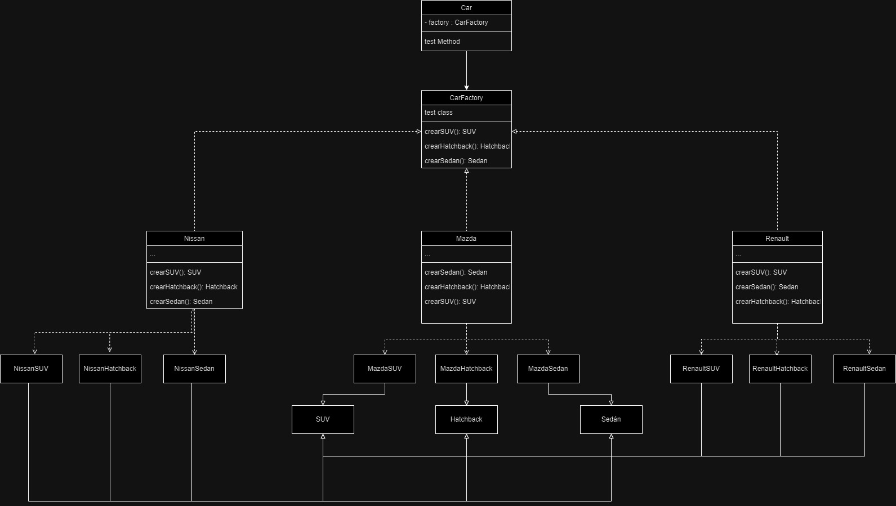

# Abstract Factory Pattern

Made by J. Q. Pimienta and Vale Martinez G.

The code implements the Abstract Factory pattern by defining an abstract class CarFactory that declares methods for creating different types of Cars (Sedan, Hatchback, SUV). These methods are implemented by concrete CarFactory classes (NissanFactory, MazdaFactory, RenaultFactory) that return specific Car objects (NissanSedan, NissanHatchback, NissanSUV, etc.).

Here's a breakdown of how the code implements the Abstract Factory pattern:

- Abstract Car Class (Car): This class defines the common properties (model, brand) and a method (getInfo) for all Car types.
- Abstract CarFactory Class (CarFactory): This class defines the interface for creating Car objects. It has abstract methods for - creating Sedan, Hatchback, and SUV cars. These methods force subclasses to implement them.
- Concrete CarFactory Classes (NissanFactory, MazdaFactory, RenaultFactory): These classes extend CarFactory and implement the abstract methods to return specific Car objects based on the brand.
- Concrete Car Classes (Sedan, Hatchback, SUV): These classes extend Car and represent the different types of Cars.

## UML Diagram

